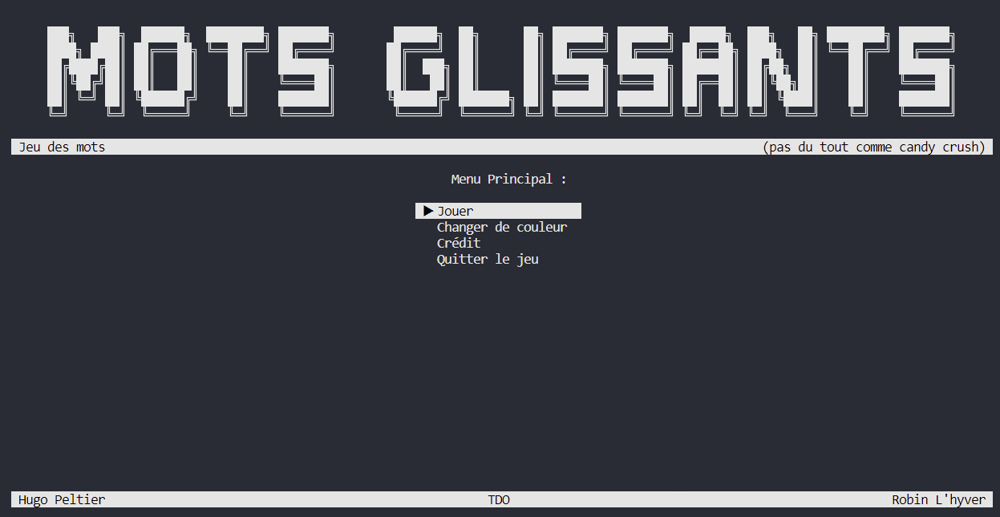

This project if a game that merge the "Candy crush style" and words.

This project has been made by *Hugo Peltier* and *Robin L'hyver* two students in engineering school for an akgorithm project.

To play you can download the zip file and then dezip it in a folder.
The actual state of the project is only useable in *VSCODE* not on VS due to the path of the different files

The actual version is made to play only in French and would be playable also in English soon ! 

The display had been made with the [ConsoleAppVisuals](https://github.com/MorganKryze/ConsoleAppVisuals) library made by MorganCryze

